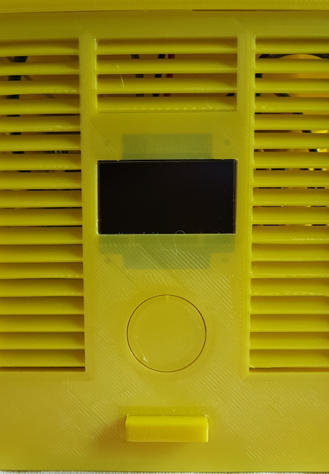
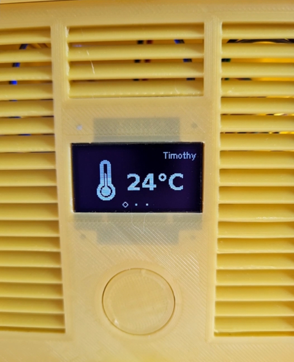
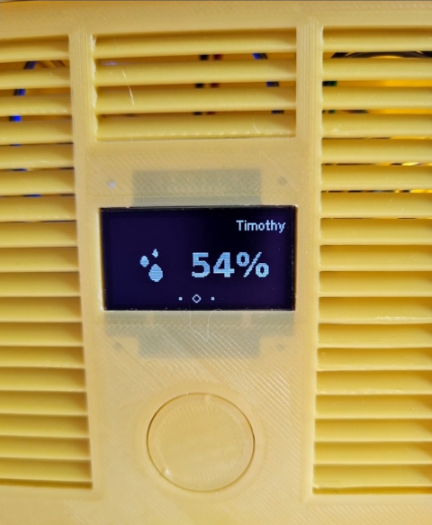
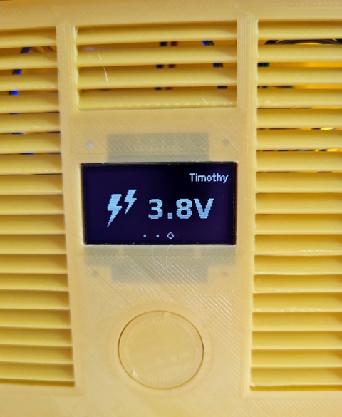
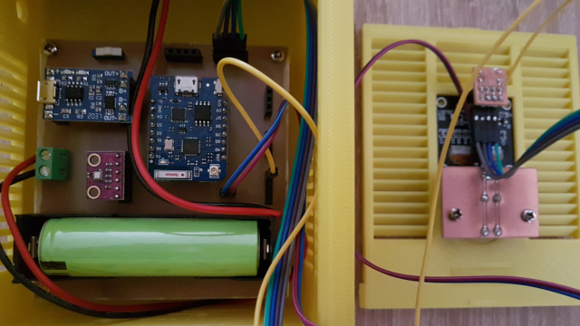

# SolarTherm WiFi Local OLED Admin aka. Solar Powered WiFi Weather Station V2 (IoT device)

A solar powered, wifi connected thermometer implemented with ESP8266 and BME280 extended for display output.

## Features

SolarTherm WiFi Local OLED Admin is:
- a extended version of my previous build SolarTherm WiFi Local Admin
- not needed if you don't plan to implement a oled display

SolarTherm WiFi Local OLED Admin is able to:
- to do everything was my previous build was doing
- displays now measurements on oled display by pressing a button
- of course going into deep sleep

SolarTherm WiFi Local OLED Admin isn't:
- just another clone of all existing solutions ;-)
- really done yet
- well coded
- well documented

## On this page

- [Features](#features)
- [ToDo](#todo)
- [Getting started](#getting-started)
  - [Before you really start](#before-you-really-start)
  - [Hardware](#hardware)
  - [Software](#software)

(This Table of Contents was manually created by myself. 【ツ】)

## ToDo

Nothing planned yet. Just a self milled, soldered and with software extended WiFi Weather Station V2.
No further improvements because i'm focused now on [V3](https://www.instructables.com/Solar-Powered-WiFi-Weather-Station-V30/) from the project founder.

## Getting started

### Before you really start

This extended version is absolutely prototyping.
I designed everything with KiCad, generated gerber and excellon files.
Coverted gerber and excellon with FlatCAM.
Milled my PCB's with bCNC, ordered parts by myself and soldered everything together like it should.

- Everything what you use from this project you use it at your own risk.
- I'll not responsible for any health or device damage.
- If you not familiar with milling on cheap chinese desktop CNC router, use the original PCB from the [V2](https://www.instructables.com/id/Solar-Powered-WiFi-Weather-Station-V20/) project instead.

### Hardware

Build the hardware recommended by Open Green Energy in his [Solar Powered WiFi Weather Station v2.0](https://www.instructables.com/id/Solar-Powered-WiFi-Weather-Station-V20/) project.

All needed files and information needed by this project including KiCAD and/or FlatCAM files will come asap.
Here i have some images from my SolarTherm OLED device (case from Debasish Dutta):

### Software

This project was built with love <3 and the [Arduino IDE](https://www.arduino.cc/en/Main/Software) to compile and upload it to the Wemos board. 
You have to install the following libraries this project depends on to your development environment:
- [WiFiManager](https://github.com/tzapu/WiFiManager.git) by tzapu (tested with version 0.16.0).

All other needed librarys and files needed by this project will come asap.

ℓ٥ﻻ ﻉ√٥υ all ❤◦.¸¸.◦✿

## About the author

This project is maintained by [Maja Aurora Pieper](https://github.com/coderpussy).